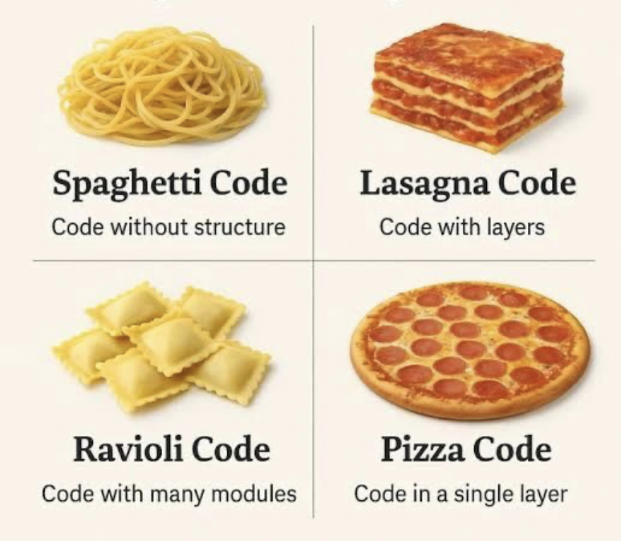

# Architecture logicielle

> Pourquoi n'existe-t-il pas une seule 'bonne' façon de concevoir une application ?

- Évaluer les différentes architectures logicielles
- Concevoir une architecture logicielle répondant aux exigences métiers
- Argumenter et défendre votre choix devant une équipe technique

---

## Jour 1 : Introduction aux architectures logicielles

1. [La théorie](./theorie.md) dans les grandes lignes
2. [Brainstorm](./exercices.md) sur des exemples de besoins
3. [Focus technique](./focus.md) : Zoom sur une architecture (du Monolithe aux Microservices)
4. [Mise en pratique](./atelier.md) : Modéliser l'architecture d'un projet fil rouge
5. [Anti-patterns & Pièges](./pieges.md) : Les erreurs classiques à éviter (Over-engineering, Monolithe distribué)
6. [Bilan & Check-list](./bilan.md) : Grille d'évaluation pour choisir sa future stack

---

## Jour 2

## Jour 3