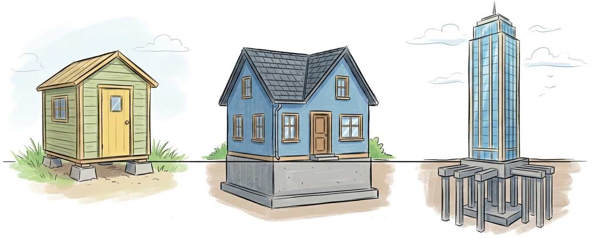
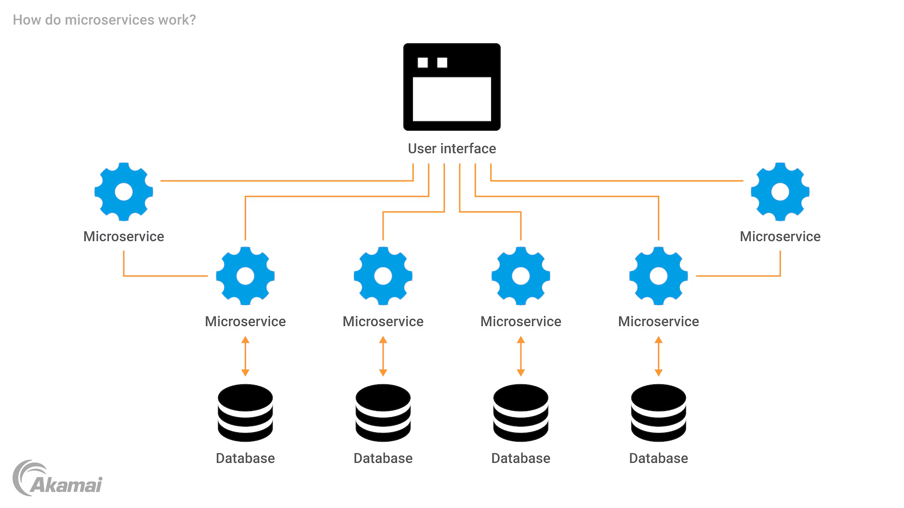
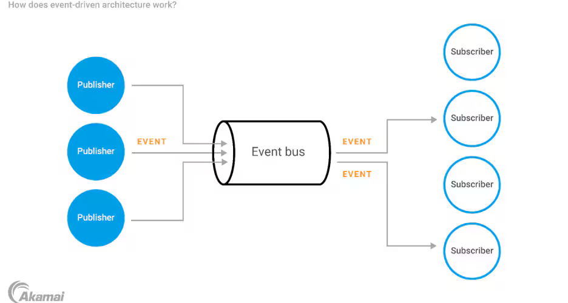

# {{ page.title }}

⏱️ Durée estimée : {{ page.duration }}

> {{ page.description }} 

## Objectifs pédagogiques

- **Distinguer** les caractéristiques, avantages et limites d'architecture logicielle.
- **Identifier** les anti-patterns d'architecture les plus courants
- **Sélectionner** une architecture adaptée à partir de scénarios et de besoins métiers.

---

## Pourquoi plusieurs architectures ?

Une cabane de jardin, une maison individuelle et un gratte-ciel ont tous des fondations, mais pas les mêmes contraintes ni les mêmes coûts.

---

### Pour un logiciel

|Crainte|Exemple|
|---|---|
| Scalabilité | Combien d'utilisateurs simultanés ? |
| Time-to-market / Budget | Faut-il sortir le produit en 2 semaines ou en 2 ans ? |
| Equipe de dev | 2 dev vs 50 dev |
| Complexité métier | Combien de règles et de cas particuliers ? |
| Résilience | Que se passe-t-il si un composant tombe ? |

---

## Panoramique express des grands modèles

⚠️ On ne rentre pas dans les détails d'implémentation, on se concentre sur les problèmes résolus et les compromis à faire avec chaque architecture.

- Monolithe
- Microservices
- Event-Driven

---

### Monolithe

> Le classique MVC : Tout le code (front, back, BDD) dans un seul projet/déploiement.

👍👍👍 Avantages : Simple à développer, rapide à déployer au début.

👎👎👎 Inconvénients : Capharnaüm si le projet grossit, scalabilité verticale obligatoire.

---

### Microservices

> L'application est découpée en petits services autonomes spécialisés (ex: Paiement, Auth, Catalogue...) qui communiquent entre eux ou avec le client.

---

👍👍👍 Avantages : Équipes indépendantes, déploiements isolés, scalabilité horizontale et ciblée.

👎👎👎 Inconvénients : Complexité réseau et latence, devops lourd, consistance des données difficile.

Une alternative est le **Service Oriented Architecture (SOA)**, qui est un peu plus centralisé et moins orienté "micro" que les microservices.

---

### Architecture orientée événements (Event-Driven)

> Les composants communiquent en émettant et en réagissant à des événements.

---

👍👍👍 Avantages : Découplage fort entre les services, haute réactivité en temps réel, excellente tolérance aux pannes (asynchronisme).

👎👎👎 Inconvénients : Complexité architecturale accrue, traçabilité des données/flux difficile, cohérence éventuelle à gérer.

---

## Conclusion

Il n'existe pas de "bonne" architecture universelle. Chaque projet a ses contraintes et ses besoins, et il faut choisir l'architecture qui y répond le mieux.

Tout est une question de **Trade-offs** 😱